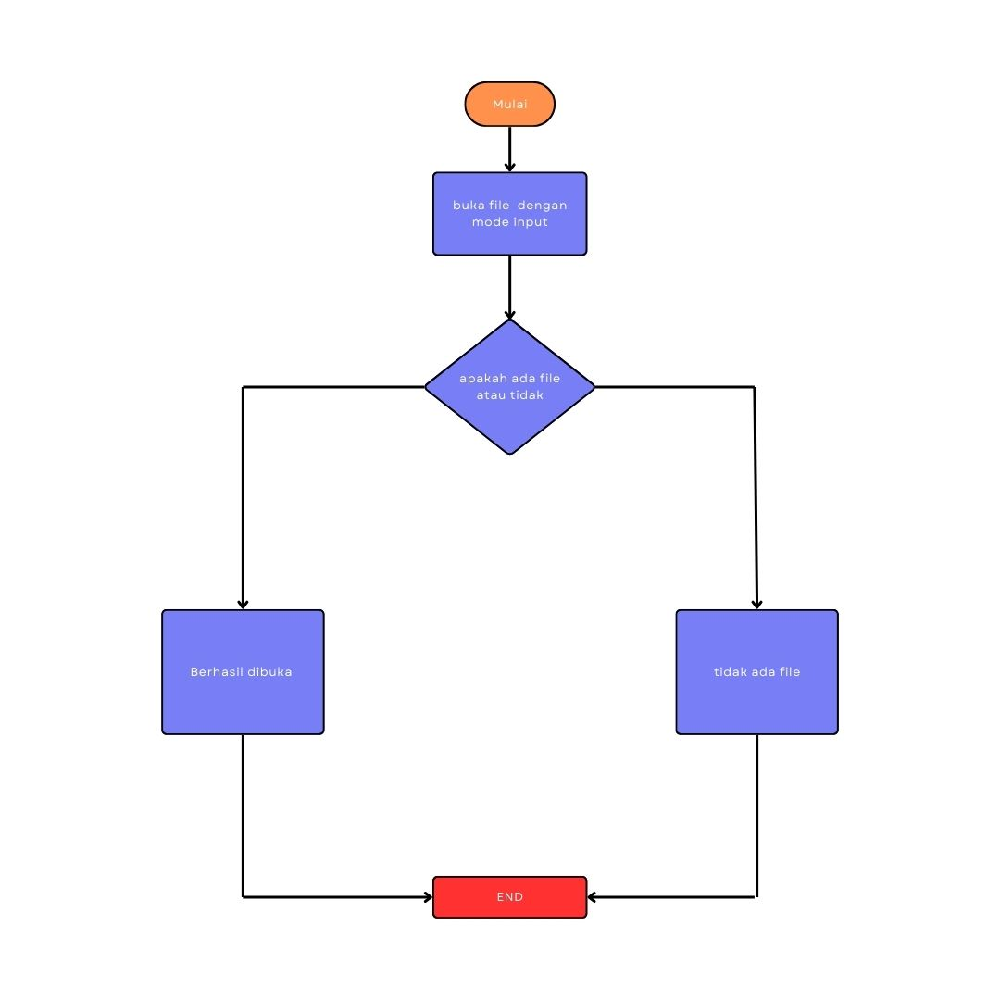

 

    
    <h3 align="center">Sistem Lumbung Padi (SiLuPa)</h3>
     

        Project and Flowchart
    

     

# Abtraksi
**Data Lumbung panen harus tersimpan dengan baik untuk memudahkan sebuah laporan. Laporan hasil panen sangat dibutuhkan untuk audit keluar masuk hasil panen. Oleh karena itu dibutuhkan sebuah sistem pengelolaan yang mampu untuk menyimpan dan menampilkan laporan keluar masuknya hasil panen. Sistem Lumbung panen adalah sebuah sistem yang digunakan untuk memantau komoditas panen, meliputi input hasil panen ke lumbung dan menampilkan jumlah panen. Selain itu sistem ini akan menampilkan laporan lumbung. Dengan adanya Sistem Lumbung Padi maka petani akan mendapatkan kemudahan dalam mengelola hasil panen.**

# Maksud dan Tujuan
**Maksud dari Sistem Lumbung Panen adalah memudahkan para petani dalam mengelola hasil panen meliputi input data barang ke stok, dan meningkatkan efektivitas petani dalam kegiatan bertani. Selain itu, Sistem Lumbung Panen ini membantu para petani menganalisa tanaman dan jenis benih apa yang cocok untuk musim-musim tertentu.**

# Flowchart 1

**Berikut alur flowchart :**

- **Program ini dimulai dengan mencoba membuka sebuah file dalam mode input. Jika file berhasil dibuka, maka program akan melanjutkan ke proses selanjutnya. Namun, jika file tidak ditemukan atau tidak dapat dibuka, program akan menampilkan pesan bahwa file tidak ada dan kemudian berakhir.**

# Flowchart 2

**Berikut alur flowchart :**

**Program ini dimulai dengan menampilkan menu utama yang berisi pilihan operasi CRUD (Create, Read, Update, Delete) untuk mengelola data tanaman. Pengguna kemudian memilih salah satu operasi yang ingin dilakukan.**

- **Create: Pengguna akan diminta memasukkan data tanaman baru, termasuk jenis tanaman, berat benih, musim tanam, dan tanggal panen. Data yang dimasukkan kemudian akan disimpan.**

- **Read: Program akan menampilkan daftar semua data tanaman yang sudah tersimpan, termasuk semua atributnya.**

- **Update: Pengguna memilih data tanaman yang ingin diubah, kemudian dapat mengubah salah satu atau semua atribut data tanaman tersebut.**

- **Delete: Pengguna memilih data tanaman yang ingin dihapus, dan data tersebut akan dihapus dari sistem.**

**Setelah melakukan salah satu operasi, pengguna dapat kembali ke menu utama atau memilih untuk keluar dari program.**

# Analisa Sistem
| No. | Modul                | Keterangan                                                                                                                                                                                                                                                        |
|-----|----------------------|-----------------------------------------------------------------------------------------------------------------------------------------------------------------------------------------------------------------------------------------------------------------|
| 1   | Membuat file          | Sistem akan membuat sebuah File dengan format .csv                                                                                                                                                                                                                                 |
| 2   | Input barang ke lumbung | Sistem akan menyediakan form untuk input barang ke lumbung meliputi:                                                                                                                                                                                                                   |
|     |                      | 1. Jenis Tanaman                                                                                                                                                                                                                                                            |
|     |                      | 2. Berat hasil panen                                                                                                                                                                                                                                                          |
|     |                      | 3. Jenis benih                                                                                                                                                                                                                                                            |
|     |                      | 4. Musim tanam                                                                                                                                                                                                                                                            |
|     |                      | 5. Tanggal panen                                                                                                                                                                                                                                                           |
